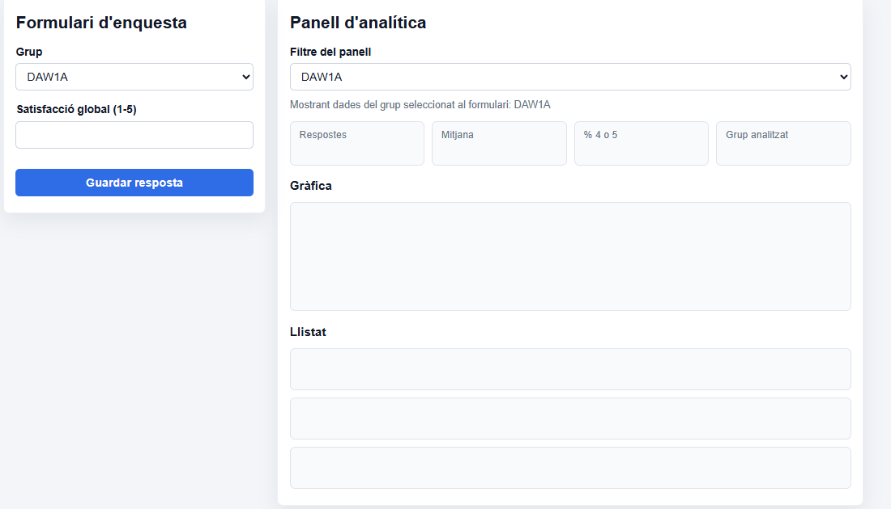
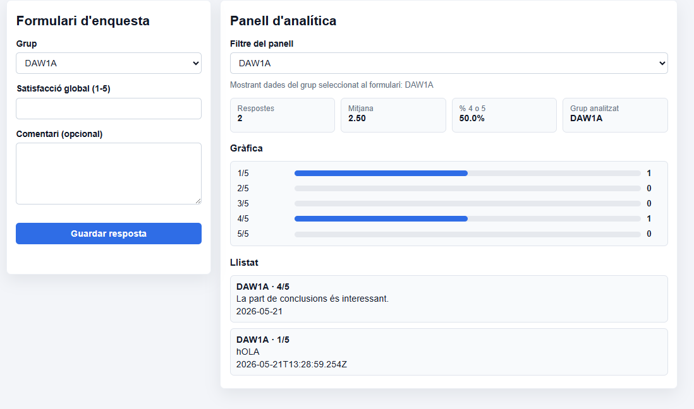
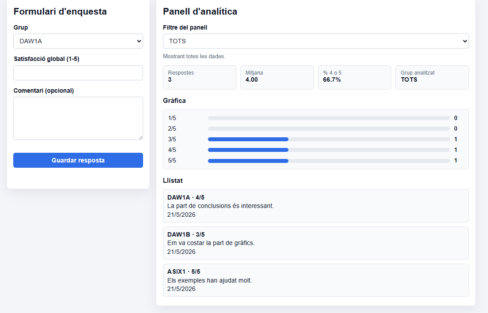
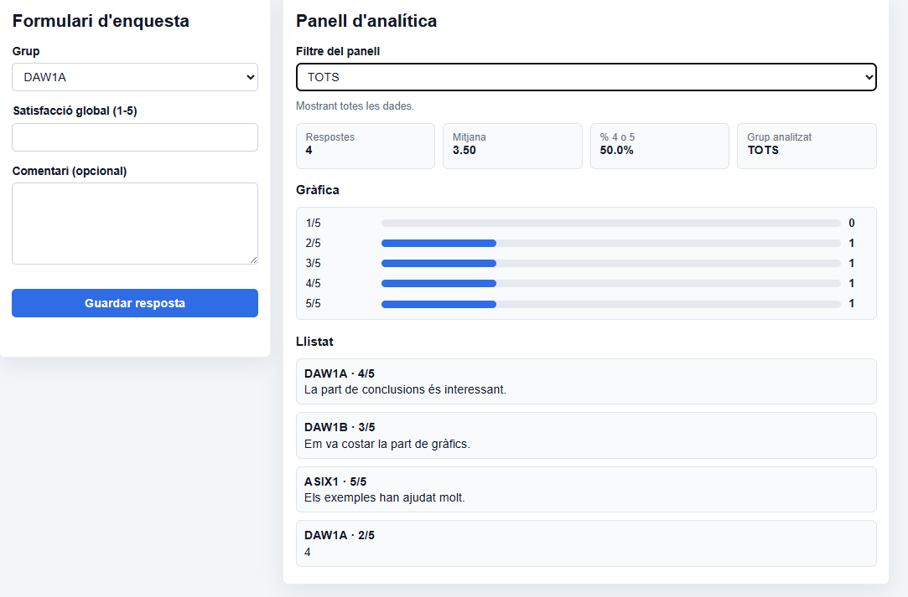
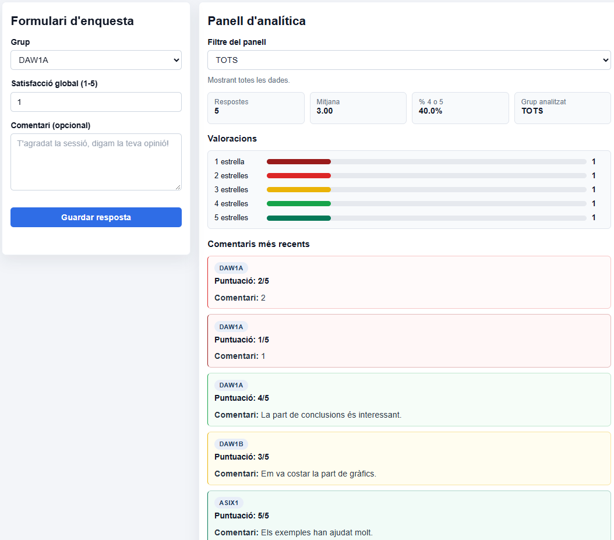
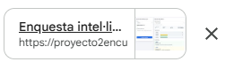
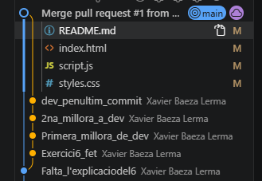

4 A

// LA PRIMER PLANTILLA QUE HE UTILIZADO HA SIDO LA SIGUIENTE

Vull que treguis tot el contingut que hi ha a l’index, al full d’estils, a l’script i també al README. Et passaré una foto del que serà la interfície final i et donaré instruccions per anar-la construint a poc a poc. El primer que et demano, segons es veu a la imatge, és que al HTML, a la columna esquerra, hi hagi el formulari buit; després, a la columna dreta, vull que facis com a la imatge i que hi hagi un panell amb espais per a KPI, que tingui gràfica i llistat. Al JS vull que afegeixis arrays que continguin “respostes” amb 3 exemples {grup, puntuació, comentari, data}. Vull que tot sigui en català.

(Explico el idioma, doy instrucciones, explico el plan y comienzo a dar ordenes)

// COMO ES UN PROYECTO QUE HICE ANTES Y LO ESTABA RE HACIENDO PEDÍ QUE BORRASE TODO Y LO COMPROBASE TODO

Comrpova que no has posat res que no t'hagi demanat. No fa falta que facis més del que et poso perque tens l'imatge. Si es així elimina-ho.

He comprobado que me ha borrado cosas innecesarias y que hay cosas fútutras que ya están por hacer

// SEGUNDO PLANTILLA QUE HE UTILIZADO

Apartir de ahora dejame el readme para mi. Yo iré apuntando cambios, curiosidades, etc. Vull que ara facis un formulari que contingui grup (DAW1A, DAW1B, ASIX1), la puntuació té que ser del 1-5 no únicament, no pot ser altres números o lletres, un número del 1 al 5. També un comentari opcional Quan l'usuari li doni a guardar: S'ha de validar i crear {id, grup, puntuació, comentari, data ISO} i tens que fer push a "respostes". Es té que refrescar el panell.

// HE COMPROBADO QUE TODO FUNCIONA Y ES ASÍ Y AHORA SOLO VOY A SEGUIR CON EL SIGUIENTE EJERCICIO Y CAMBIAR ALGUNAS COSAS MEJORABLES

M'he donat conta que no estaba fent commits i ara he fet un commit.

4 B

// TERCERA PLANTILLA

Ara el que m'agradaria que fesis es que la data només mostris el dia l'any y el mes no altres dades com minut, milisegon, etc. Vull que facis una funcio que sigui "calcularEstadistiques" que calculi respostes i grupFiltre, vull que també tingui total, la Mitjana i les positivesPercent. Vull que grupFiltre que es diu "TOTS" utilitzi totes les dades. Comprova que amb cada grup només hi ha respostes d'aquell grup. Si hi ha 0 respostes no surt error, sortirpa un 0 o un "-".

Aqui tengo que decir que me he dado cuenta de que ya lo tenía hecho a medías y la IA no me lo borro y me confundí y se lo tenía que haber borrado. Sin embargo ha mejorado los comentarios, ya no me pone la fecha. Pone mensajes que antes no ponía cuando muestra una clase de DAW.

He revisado lo de la fecha y no me ha gustado así que simplemente le pido que me lo quite y avanzo con el siguiente ejercicio.

Se me ha olvidado poner una captura de como se ve, he revisado que antes no tenía TOTS.

// CUARTA PLANTILLA

Primer de tot vull que treguis la data dels dies. Després vull que crees una gràfica de barres amb les puntuacions de l’1 al 5 segons el filtre seleccionat. Molt important que tens que comprovar que les barres coincideixen amb el recompte real de respostes.

Por lo que he visto, se ve bastante bien y está estructurado como pide. Aún creo que se puedo añadir quizás más css y decorarlo mejor pero de momento veo mejor seguir, con la plantilla añadida se hizo el 4 y 5 y así se ve.

// QUINTA PLANTILLA

Vull que revisis si ha qualsevol error de ser així vull que ho corregeixis. He comprobat afegint dades pero no he trobat error. Vull que facis un revamp, vull que on està la grafica en comptes de "gràfica" posis Valoracions, en les valoracions posis, x estrelles en comptes de x/5, vull que en els comentaris posis el següent, en comptes de "Llistat" posa "Comentaris" i quan s'afegixi un de nou que posi "Comentaris més recents". Vull que per cada nota, del 1 al 2 i hagi un to de vermell, l'1 serà el més fosc, el 3 serà groc, el 4 i el 5 pasa el mateix que amb el 1 i 2 només que el 1 serà el verd més fort. Vull que aparegui la clase al comentari una miqueta més decorada, abaix la puntuació i abaix de la puntuació el comentari, si es que hi ha. Que en la satisfacció per default es posi el número 1.  Un comentari al comentari opcional així com en gris com a l'imatge que et vaig passar que posi "T'agradat la sessió, digam la teva opinió!".

He querido remodelar un poco el aspecto ya que estaba muy apagado para que sea mejor visualmente y se entienda  mejor para el usuario y ahora me pondré a mirarme el código y ver que es lo que entiendo y que es lo que no entiendo.

Finalmente le he puesto otro prompt y ahora está mejor todo y que queden los quesitos y la comparativa entre clases.

Que fa guardarRespostes(), calcularEstadistiques() i el filtre??

guardarRespostes(); S'utilitza quan l'usuari envia el formulari, gracias al preventDefault() la pagina no es carrega de nou, comprova que el comentari i la puntuació sigui entre 1 i 5 i guarda la resposta dins de l'array respostes amb el push(). Després actualitza el panell amb resfrescarPanell()

calcularEstadistiques(); La funció calcula les dades que hi ha al panell. El que fa es filtrar les respostes segons el grup seleccionats, quan ha calculat totes les respostes segons el grup el que fa es calcular el total de respostes en general "TOTS", també calcula la mitjana de puntuacions i si el percentatge de valoracions positives es un 4 o 5. Quan ho te tot calculat el retorna les dades.

Filtre, el filtre funciona amb el select de grups. Quan l'usuari decideix cambiar de group, s'executa la funció refrescarPanell(), la funció refrescarPanell(), crida a una funció que es diu filter() per mostrar les respostes del grup que s'ha seleccionat i llavors les dades s'actualitzen.

IA 3 Exercici 1 - Repositori i branca main

He creat la rama dev

Exercici 2 - Branca dev i treball

He cambiat el TOTS i he modificat el JS de manera manual perque s'apliquin bé els canvis

He afegit al CSS que el contingut sigui més gran al quan mostra les dades, aquesta plantilla he fet servir

//PLANTILLA Solo quiero que ahora no toques ni javascript ni html ni readme ni otra cosa, solo quiero que me cojas el contenido que aparece en respostes, mitjana, % 4 o 5 i grup analitzat quiero que todo el contneido que hay dentro, lo hagas mas grande con una letra mas grande

Exercici 3 - Pull request i merge

// ESCRIT DESDE DEV, SI FUNCIONA ES VERÀ A MAIN.

Exercici 4 - Desplegament a Vercel

